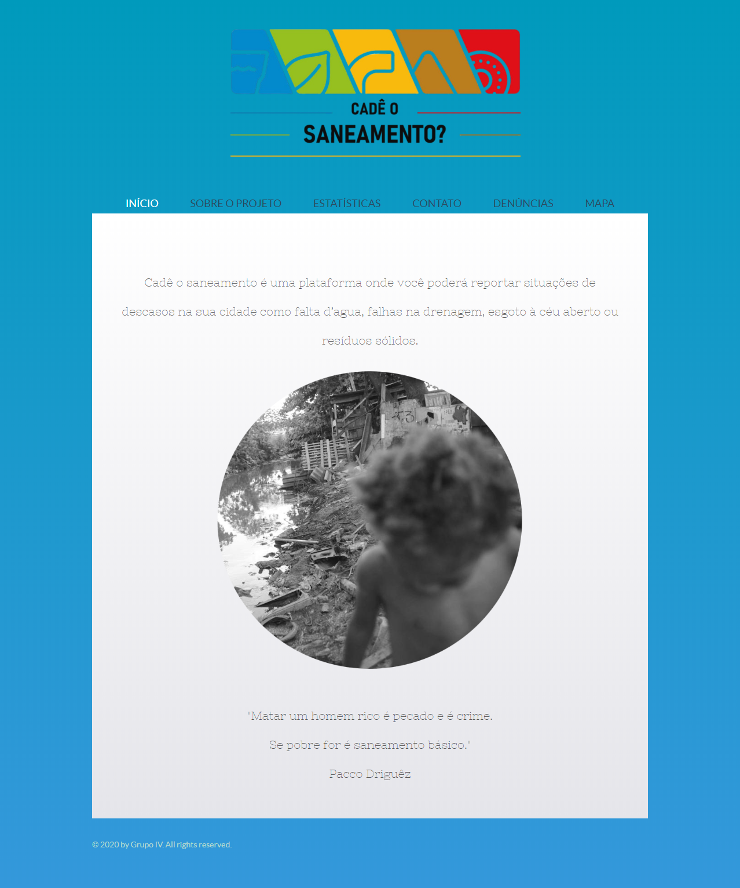
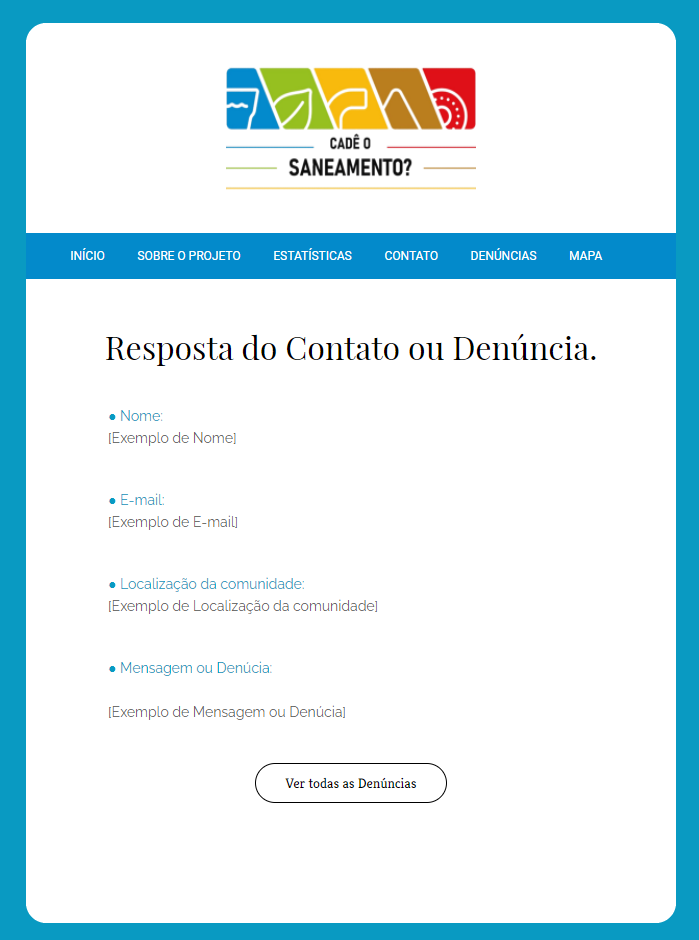

<h1 align="center">
    Projeto "Cadê o saneamento ?"
</h1> 

## Sobre

O Projeto " Cadê o saneamento? " é um Website que redireciona suas reclamações de saneamento básico de acordo com sua geolocalização.

Template responsivo com integrações, desenvolvido no evento "1º Hackathon para Seleção de Estagiários do BNDES (2020)".

## Tecnologias

- HTML5, 
- CSS3, 
- Bootstrap, 
- JavaScript (JS),
- Jquery ➡️ Disponível na versão [v0.4.0](https://github.com/MJr0019/Cade-o-Saneamento/releases/tag/v0.4.0) em diante,
- API de Localização do Google Maps ➡️ Disponível na versão: [v0.1.0](https://github.com/MJr0019/Cade-o-Saneamento/releases/tag/v0.1.0), 
- [MapBox](https://www.mapbox.com/) ➡️ Disponível na versão [v0.2.0](https://github.com/MJr0019/Cade-o-Saneamento/releases/tag/v0.2.0) em diante,
- [Enivo de E-mail's em JS](https://smtpjs.com/), 
- [Servidor SMTP de Desenvolvimento](https://elasticemail.com/) ➡️ Disponível na versão [v0.2.5](https://github.com/MJr0019/Cade-o-Saneamento/releases/tag/v0.2.5) em diante,
- [Servidor SMTP de Debug](https://mailtrap.io/).

## Status

- Projeto está lançado.

    [Versão do Hackathon](https://github.com/MJr0019/Cade-o-Saneamento/releases/tag/v0.1.0)

    - [Última Versão do Projeto](https://github.com/MJr0019/Cade-o-Saneamento/tags)

## Preview

- Projeto

[Veja o projeto](https://cade-o-saneamento.000webhostapp.com/index.html)

- Exemplo do E-mail

[Veja o exemplo do E-mail](https://cade-o-saneamento.000webhostapp.com/mail/contato/MailContato.html)

## Desenvolvedores

* Grupo IV
    
    - [Marcílio Júnior](https://github.com/MJr0019), 

    - [Rhuan Felipe Pasti](https://github.com/rhuanpasti),

    - [Pedro Lucas](https://github.com/pancine) e 
    
    - [Pedro Soares](https://github.com/Pidroka).

## Download & Instalação

Para começar a usar este modelo, siga as seguintes opções para começar:

* Clone o Repositório: `git clone https://github.com/MJr0019/Cade-o-Saneamento.git`

ou

* Baixe a [Última Versão do Projeto](https://github.com/MJr0019/Cade-o-Saneamento/tags)

* Mude os dados do STMP no arquivo [mail.js](https://github.com/MJr0019/Cade-o-Saneamento/blob/master/js/mail.js)
➡️ Informação e documentação do SMTP [aqui](https://github.com/MJr0019/Cade-o-Saneamento/blob/master/read-me.txt) na lista de links.  

## Bugs & Problemas

Tem um bug ou um problema com este template? [Abra um novo "issue"](https://github.com/MJr0019/Cade-o-Saneamento/issues) aqui no GitHub.

## Licenças

