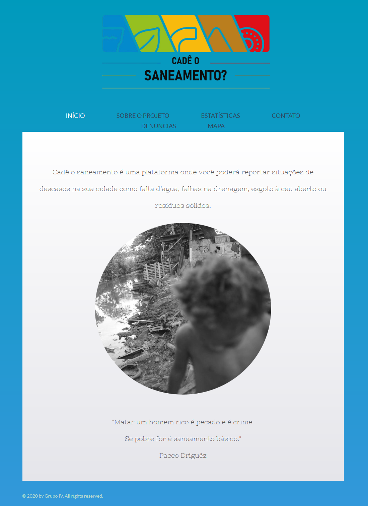

# Projeto "Cadê o saneamento ?"

## Sobre

O Projeto "Cadê o saneamento? é um Website que redireciona suas reclamações de saneamento básico  de acordo com sua geolocalização.

Template responsivo com integrações, desenvolvido no evento "1º Hackathon para Seleção de Estagiários do BNDES (2020)"

## Tecnologias

HTML5, CSS3, JS, Bootstrap, API de Localização do Google Maps

## Status

Projeto está em fase de Desenvolvimento.

## Preview

[Veja o projeto](https://cadeosaneamento.000webhostapp.com/index.html)

## Desenvolvedores

* Grupo IV

[Marcílio Júnior](https://github.com/MJr0019) , 
[Rhuan Felipe Pasti](https://github.com/rhuanpasti) ,
[Pedro Lucas](https://github.com/pancine) ,
[Pedro Soares](https://github.com/Pidroka)

## Download & Instalação

Para começar a usar este modelo, siga as seguintes opções para começar:

* Clone o Repositório: `git clone https://github.com/MJr0019/Cade-o-Saneamento.git`

* Mude os dados do STMP no arquivo [mail.js](https://github.com/MJr0019/Cade-o-Saneamento/blob/master/js/mail.js)

## Bugs & Problemas

Tem um bug ou um problema com este template? [Abra um novo "issue"](https://github.com/MJr0019/Cade-o-Saneamento/issues) aqui no GitHub.

## [Licenças](https://github.com/MJr0019/Cade-o-Saneamento/blob/master/LICENSE)

MIT license, Open source code License, Free-software license
